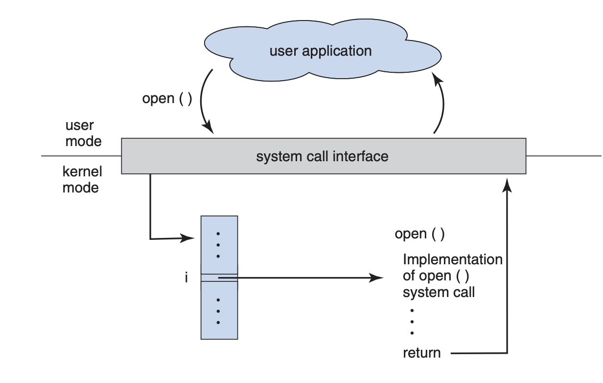
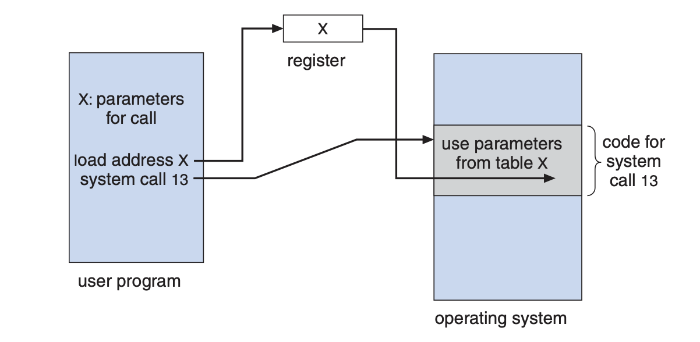
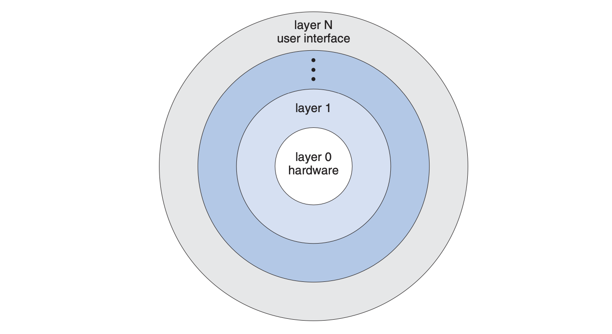

#  understanding operating systems

###  user interface

can be command line cli, graphics user interface gui, or batch

allows user interaction with system service via system calls (typically written in c/c++)

###  system services for users

program execution

i/o operations

file system manipulation

communications

error detection

###  services for efficient os operation

resource allocation

accounting

protection and security

###  system calls and apis

accessed via apis such as win32, posix, java

each system call has an associated number

system call interface maintains a table indexed by these numbers

###  passing parameters in system calls

methods include passing in registers, address of parameter stored in a block, pushed onto the stack by the program, popped off by the os

block and stack methods allow for flexibility in the number and length of parameters

###  types of system calls

process control - end, abort, load, execute, create process, terminate process, get process attributes, set process attributes, wait for time, wait event, signal event, allocate and free memory

file management - create file, delete file, open, close, read, write, reposition, get file, attributes, set file attributes

device management - request device, release device, read, write, reposition, get device attributes, set device attributes, logically attach or detach devices

information management - get time or date, set time or date, get system data, set system data, get process, file, or device attributes, set process, file, or device attributes

communications - create, delete communication connection, send, receive messages, transfer status information, attach or detach remote devices

###  understanding operating system components

operating systems facilitate user interactions with computer hardware and resource management

two fundamental co`mponents of an operating system are the kernel and the shell

###  shell commands in c++ (windows vs unix)

| function                | windows command   | unix command   |
|-------------------------|-------------------|----------------|
| list directory contents | `dir`             | `ls`           |
| create directory        | `mkdir`           | `mkdir`        |
| remove directory        | `rmdir`           | `rmdir`        |
| copy file               | `copy`            | `cp`           |
| delete file             | `del`             | `rm`           |
| move file               | `move`            | `mv`           |
| print working directory | `cd`              | `pwd`          |
| display file content    | `type file.txt`   | `cat`          |

###  shell

definition:  user interface for interacting with the os

functionality:  accepts users commands, translates them for the kernel

###  kernel

definition:  core component managing system resources

responsibilities:  memory management, process scheduling, device management

interaction:  directly communicates with hardware

###  system calls

`fork()` - creates a new process by duplicating the calling process

`exec()` - replaces the current process with a new process

`wait()` - makes the calling process wait until one of its child processes terminates

`exit()` - terminates the calling process and returns a status to the parent process

`open()` - opens a file or device and returns a file descriptor

`read()` - reads data from a file descriptor into a buffer

`write()` - writes data from a buffer to a file descriptor

###  difference between shell and kernel

shell - user interface, interprets user commands, translates them for the kernel

kernel -  core system component, manages hardware and resource

###  os layered approach

divided into layers (level), with hardware at the bottom (layer 0) and the user interface at the top (layer n).

each layer uses functions and services of lower layers

###  virtual machines

uses a layered approach

treats hardware and os kernel as hardware

host creates the illusion of a dedicated processor and memory for each process

each guest had a virtual copy of the computer

###  error handling

application failures generate core dump files capturing the memory of the process

os failures generate crash dump files containing kernel memory

###  activity

start to look at system calls for the kernel and for the shell commands

###  questions

what are the system services provided by the operating system?

what are the two fundamental components of an operating system?

what is the user interface of the functionality of an operating system?