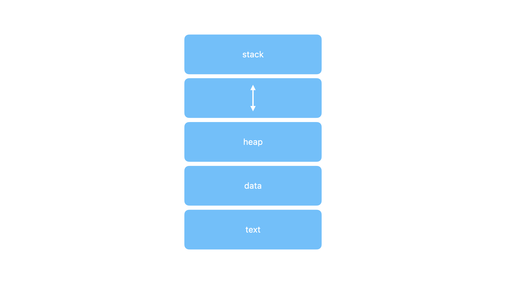
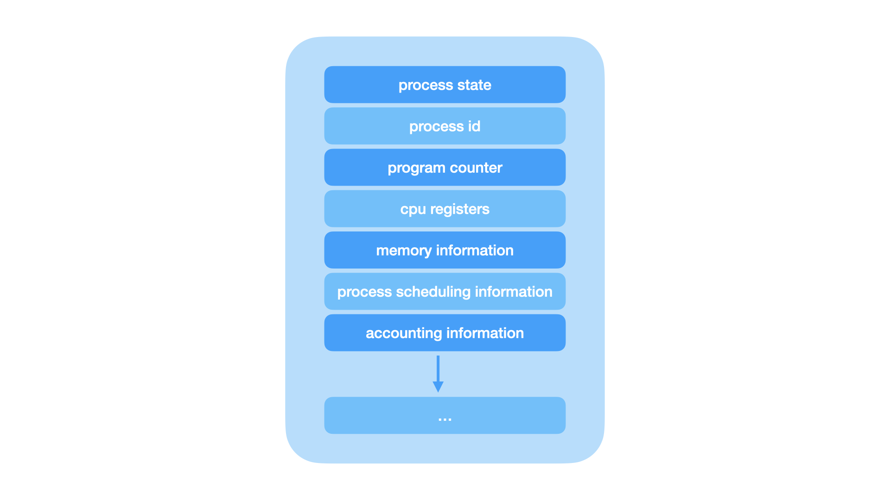
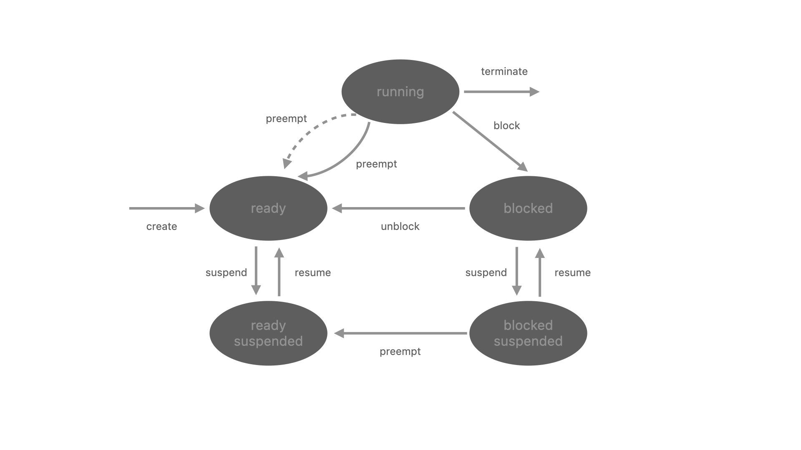

#  understanding process components and management

##  what is a process

a process is a program in execution.  

for example when we write a program in c or c++ and compile it, the compiler create binary code.  the original code and binary code are both programs.  when we run the binary code it becomes a process.

##  what is process management

**definition**  techniques and strategies used to design, monitor, and control business processes for efficient and effective goal achievement

**importance in operating systems**

-  critical for multi-user environments

-  tracks and schedules processes

-  dispatches processes sequentially

-  ensures users feel they have full control of the cpu

##  benefits

**operational efficiency** -  streamlines task completion steps and resource usage

**cost reduction** -  identifies and eliminates inefficiencies

**customer satisfaction** - improves service delivery and responsiveness

**compliance** -  ensures adherence to regulatory standards

##  process components

**text section** -  contains the code and current activity (program counter)

**stack** -  holds temporary data like function parameters and local variables

**data section** -  stores global variables

**heap section** -  manages dynamic memory allocation

<p align=center>
    
</p>

##  characteristics of a process

**process id** -  a unique identifier assigned by the operating system

**process state** -  can be ready, running, etc

**cpu registers** -  like the program counter (cpu registers must be saved and restored when a process is swapped in and out of the cpu)

**accounts information** -  amount of cpu used for process execution, time limits, execution id, etc

**1/0 status information** -  for example, devices allocated to the process, open files, etc

**cpu scheduling information** -  for example, priority (different processes may have different priorities, for example, a shorter process assigned high priority in the shortest job first scheduling)

**note** -  diagram shows a typical structure of a process control block (pcb) containing these attributes

<p align=center>
    
</p>

##  states of process

<p align=center>
    
</p>

**new** -  newly created process or being created process

**ready** -  after creation, process moves to ready state, i.e. ready for execution

**run** -  currently running process in cpu (only one process at a time can be under execution in a single processor 

**wait or block** -  process requests i/o access

**complete or terminate** -  the process completed its execution

**suspended ready** -  when the ready queue becomes full, some processes are moved to a suspended ready state

**suspended block** -  when the waiting queue becomes full

##  real life scenario

imagine you're cooking a meal in your kitchen.  you have several tasks to complete, like chopping vegetables, boiling water, and frying ingredients.  your kitchen has limited resources - only so many burners on a stove, a single cutting board, and one set of knives.

process -  cooking a dish, boiling water, chopping vegetables

resource -  stove, pots, knives, ingredients

states

ready -  ingredients are prepped, but not yet cooking

running -  a dish is being cooked on the stove

waiting -  waiting for the water to boil

terminated -  the dish is cooked and ready to be served

##  activity

case scenario -  the cafe analogy

image you are the manager of a busy cafe.  the cafe has a limited number of tables, baristas, and kitchen space to serve customers.  each customer who enters need to be seated, place an order, and have their food or drinks prepared by the baristas.

**who or what represents a process?  explain how this analogy helps you understand what a process is in an operating system**

a process is like a customer in the cafe.  each customer has a unique order and needs to be served by the cafe staff.  in the same way, a process is a program that needs to be executed by the operating system

**who or what represents a cpu in a computer system?  how does this help you understand the running state of a process?**

the barista represents the cpu.  the barista prepares the food and drinks for the customers, similar to how the cpu executes instructions for a process.

**who or what represents a system resource?  how does this help you understand the waiting or block state of a process?**

the tables, kitchen space, and baristas represent system resources.  when a customer is waiting for their order to be prepared, they are in the waiting state, similar to how a process waits for system resources to be available.

**what happens when multiple customers arrive at a cafe at the same time?  how does this scenario relate to processes in an operating system?**

when multiple customers arrive at the cafe, the staff must manage the orders and serve them efficiently.  they schedule the orders based on priority and availability of resources.  for example a party of 4 customers and a party of two customers may be served in the order they arrived, however there is only a table available for 2 customers.  the party of 4 must wait for a table to become available.  in the same way, an operating system must manage multiple processes that need cpu time and other resources.

**consider a scenario where a customer must leave suddenly before finishing their coffee.  how would you relate this to the concept of process?**

when a customer leaves suddenly, their order is terminated.  in the same way, a process can be terminated if it completes its task or is interrupted by the operating system.

**how does the cafe handle peak hours when many customers arrive simultaneously?  relate this to how an operating system manages multiple processes that need cpu time and other resources.**

when a cafe has peak hours, the staff must have status information regarding the amount of tables already allocated, the number of baristas available, and the kitchen space.  they must prioritize orders and manage resources efficiently to serve all customers.  in the same way, an operating system must have 1/0 status information about the resources allocated to each process and schedule them based on priority and availability.

##  types of processes

i/o bound spends more time doing i/o than computations, many short cpu bursts

cpu bound spends more time doing computations, few very long cpu bursts

cpu burst is a period when the cpu is fully engaged with a process's tasks

##  ex i/o bound processes

##  importance in scheduling

understanding whether a process is i/o bound or cpu bound helps the os scheduler to allocate cpu time more effectively.  

for example, scheduling algorithms may prioritize i/o bound processes to keep the system responsive.  since i/o bound processes often spend time waiting for i/o and quickly free up the cpu, this allows cpu bound processes to run during those idle period, making the system more efficient.

##  context switching

**when cpu switches to another process**  this saves the state of the old process to pcb.  load the saved state from pcb for the new process

**context switch time** dependent on hardware.

##  process creation

**parent processes create children processes**  forms a tree

**process management** using process id pid

**resource sharing** all, some, or none

**execution** concurrently with child, waits until children terminate

##  system calls

**`fork()`**  create a new process

**`exec()`**  replace the process's memory space with a new program

##  understanding forking with illustrative example

imagine one participant draws a simple picture or scene on their paper.  this drawing represents the "parent process" in an operating system.  now, another participant is asked to replicate this drawing exactly on their sheet of paper.  this second drawing represents the "child process" that is created an a process is forked.  both participants work independently.  changes made to one drawing do not affect the other.  this illustrates how each process has its own space and does not automatically share changes with the other.

##  reflection

**process independence**  the drawings show how processes run separately and do not affect each other

**initial copy, independent evolution**  the child process starts as a copy with the same state but can develop differently, similar to the drawings

**separation of tasks**  changes in one process do not impact the other, demonstrating effective multitasking

##  activity

step 1 -  read the code.  read through the provided code snippet to understand its structure and what it does

step 2 -  identify fork calls.  identify the locations in the code where the `fork()` function is called.  each `fork()` call creates a new child process

step 3 -  count forks.  count the number of `fork()` calls in the code.  for each `fork()` call, determine how many additional processes it creates

step 4 -  calculate total forks.  add up the number of additional processes each `fork()` call creates to find the total number of forks created in the code.

step 5 -  final answer.  share your findings.  how many forks are created in the provided code snippet?


```cpp
#include <stdio.h>
#include <unistd.h>

int main() {
    fork();
    fork();
    fork();
    return(0);
}
```

##  activity results

there are 3 `fork()` calls in the code.

each `fork()` call creates 2 additional processes.

`fork()` is called 3 times, the first `fork()` creates 1 process, the second `fork()` creates 2 processes, and the third `fork()` creates 4 processes.  this results in 7 processes.

the `fork()` function creates a new child process by duplicating the calling process.  each `fork()` call creates a new child process, resulting in multiple processes running concurrently.

the code snippet demonstrates how `fork()` can be used to create multiple processes in a program.

understanding how `fork()` works is essential for process management and creating multi-process applications.

##  interprocess communication

shared memory -  a method where multiple processes share a common memory space to communciate and exchange data

message passing -  a method where processes communicate by sending and receiving messages, usually through a communication or a messaging queue.

##  message passing

**blocking synchronous**

blocking send -  sender waits until the message is received

blocking receive -  receiver waits until a message is available

**non-blocking asynchronous**

non blocking send -  sender sends and proceeds without waiting

non blocking receive -  receiver checks for a message; continues if none is found

##  current challenges in os processes

concurrency issues -  managing multiple processes efficiently, especially in multi core systems

security in processes -  ensuring that processes do not interfere with each other and protecting system integrity

resource allocation -  fair and efficient distribution of cpu, memory, and i/o resources among completing processes

##  the need for advanced os processes

**dynamic resource management**  adaptive algorithms that adjust resource allocation based on real time needs

**ai assisted process scheduling**  utilizing ai to predict and optimize task scheduling for better performance

**enhanced security protocols**  advanced techniques to isolate and protect processes from malicious interference

##  core processes of a future operating system

**modular process management**  a system where processes can be independently updated and optimized

**context aware processing** processes that adapt based on the current environment, device, and user behavior

**scalable process handling**  efficient process management across diverse devices from iot to high performance computing

##  potential features in process management

**ai driven resource allocation**  ai optimizes how resources are distributed to processes based on usage patterns

**seamless cross platform processes** processes that maintain state and functionality across different devices

**user controlled process prioritization**  allowing users to prioritize which processes should receive more system resources

####  how can an operating system balance process efficiency with user experience?

an os can balance efficiency and user experience by implementing adaptive process management.  for instance, the os could prioritize **foreground applications** (those actively used by a user) while optimizing background tasks to minimize resource use.  ai driven predictions can enhance responsiveness, ensuring **critical tasks receive more cpu and memory with causing delays**.  additionally, providing users with customizable settings allow them to decide how much system performance is devoted to specific tasks, enhancing overall satisfaction while maintaining efficiency.