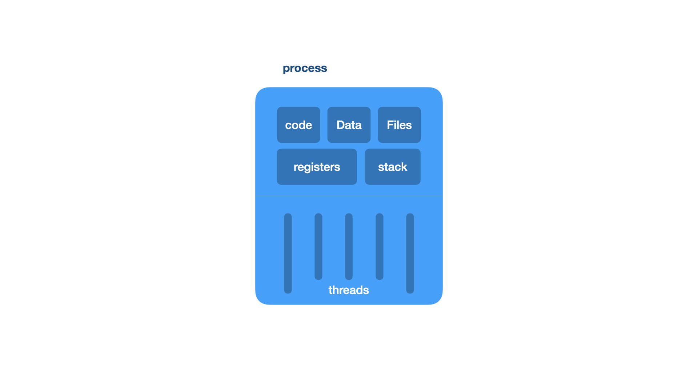

#  understanding threading

##  introduction to threading

**definition** -  a thread refers to a single sequential flow of activities being executed in a process

**shares** -  information like data segment, code segment files, etc. with its peer threads

**contains** its registers, program counter, stack

**significance**

##  types of threads

user level threads

kernel level threads

##  user level threads

user level threads are implemented by users

the kernel is unaware of the existence of user level threads

the kernel treats user level threads as single threaded processes

user level threads are small and much faster than kernel level threads

represented by program counter pc, stack, registers, and small process control block pcb

no kernel involvement in synchronization for user level threads

##  kernel level threads

kernel level threads are handled by the operating system directly

thread management is done by the kernel

the kernel manages context information for both the process and its threads

kernel level threads are larger and slower than user level threads

##  advantages and disadvantages of user level threads and kernel level threads

| aspect | user level threads | kernel level threads |
|:-------|:------------------|:--------------------|
| advantages | faster | only blocks the calling thread |
|advantage | more resource efficient | kernel manages scheduling and resources |
| advantages | quicker context switching | easier synchronization |
| advantages | simpler to implement | easier to debug |

##  multi threading

the ability of a program or an operating system to enable more than one user at a time without requiring multiple copies of the program running on the computer

##  examples of multithreading

in a browser, each tab can be a different thread

microsoft word employs multiple threads one for text formatting, another for processing inputs, etc.

##  multi threading models

**many to one** -  many user level threads mapped to a single kernel thread

**one to one** -  each user level thread maps to a kernel thread

**many to many** -  many user level threads mapped to many kernel threads

##  many to one model

**description** -  many user level threads mapped to a single kernel thread

**advantage** -  simple to implement

**disadvantage** - if the kernel thread blocks, all user level threads are blocked

[t] [t] [t] [t] user thread
  \ |    |  /
      [k] kernel threads

##  example 

image you are working on your computer,  you can have several programs open at the same time like a word process, a web browser, and a music player.  all of these programs are running under your user...

##  one to one model

**description** -  each user level thread maps to a kernel thread

**advantage** -  as more concurrency as other threads can run if one thread is blocked

**disadvantage** -  creates overhead due to large number of kernel threads

[t] --- [k]

[t] --- [k]

[t] --- [k]

[t] --- [k]

##  example

think of a process as a task or job your computer is doing, like running a game or a web browser.  each of these tasks has a unique id...

##  many to many model

<p align=center>
    
</p>

##  example

think of files on your computer like documents or pictures.  different users can have different kinds of access to these files some might be able to read them, some might be able to write them, and some might not have access at all.

##  thread libraries

**purpose** -  provide programmers with an api for creating and managing threads

**examples** -  posix pthreads, java threads, windows threads

##  issues with multi threading

thread cancellation, signal cancellation

##  thread cancellation

##  signal handling

##  handling thread specific data

##  basic thread creation and execution

**define functions** -  two functions, `print_numbers`, `print_letters` are defined.  each function prints a sequence of items with a 1 second delay between prints

**create threads** -  two threads, `t1`, `t2` are created.  `t1` runs the `print_numbers` function, and `t2` runs the `print_letters` function

**start thread** -  both threads are started using the `start()` method which triggers the execution of the respective functions

```python
import threading
import time

def print_numbers():
    for i in range(1, 6):
    print(f"number: [i])
    time.sleep(1)

def print_letters():
    for letters in ["A", "B", "C", "D", "E"]:
        print(f"letter: [letters]")
        time.sleep(1)

#  creating threads
t1 = threading.Thread(target=print_numbers)
t2 = threading.Thread(target=print_letters)

#  starting threads
t1.start()
t2.start()

#  waiting for threads to finish
t1.join()
t2.join()
```

##  question

**what is the difference between processes and threads?**

processes deal with resource ownership, while threads are units of execution

**which system call is primarily responsible for creating both processes and threads?**

`clone()` because it allows the child process to share parts of its execution context with the calling process.  both processes and threads are created with `clone()` system call.

**how does the `fork()` function differ from `pthread_create()` in terms of resource sharing?**

`pthread_create()` shares more resources than `fork()`

**which of the following is the key advantage of threads over processes?**

threads have faster inter-thread communication

**in the context of this article, which statement is true about processes and threads in linux?**

processes and threads are both considered tasks and are similarly scheduled

##  process vs thread

| aspect | process | thread |
|:-------|:--------|:--------|
| memory | separate | shared |
| overhead | higher | lower |
| communication | uses ipc | easy within process |
| creation | slower and more expensive | faster and cheaper |
| isolation | isolated from other processes | not isolated; affects other threads |

##  example of a thread

background tasks or operations within an application

##  when to choose between using processes and threads

**processes** have better isolation, security, fault tolerance.  use when tasks are independent and require separate memory spaces.  examples include web servers handling each request in a separate process, microservices architecture with separate processes for different services, and database systems with each client connected in a separate process

**threads**  have faster communication and resource sharing.  use when tasks are interdependent and can benefit from parallel execution.  examples include real time data processing in a stock trading application, gui applications with the main thread for ui and background threats for tasks, parallel computation in scientific applications, and web server with thread pools for handling multiple connections.

<p align=center>
    
</p>


##  understanding the sleeping barber problem

you own a small barber shop with one barber, one barber chair, and a waiting room with three chairs.  when a customer arrives, they will either take a seat in the waiting room or leave if no chairs are available.  if the barber is idle and a customer arrives, the barber begins cutting their hair immediately.  once a customer's hair is cut, they leave and the barber checks for waiting customers before either starting on the next customer or going to sleep if non are waiting.

understand the flow of events in the barber shop

think critically about synchronization challenges and propose solutions

####  questions

**1.  describe the main entities in this problem and their roles**

entities -  barber, customers, barber chair, waiting room chairs

the barber cuts hair and sleeps if there are no customers

customers come to get a haircut, wait if necessary or leave if all chairs are occupied

the barber chair is used for cutting hair

the waiting room has chairs for customers to wait if the barber is busy

**2.  what synchronization issues can arise in this scenario?**

**race condition** -  multiple customers arriving at the same time

**deadlock** -  barber waiting for customers, while customers leave due to perceived unavailability of barber chair

**starvation** -  if customers continually arrive when the barber is about to sleep, the barber might never get a chance to rest

**3.  how would you use semaphores to manage access to the barber chair and the waiting room chairs?**

**barber chair semaphore** -  initialize to 1 to ensure only one customer can be in the chair

**waiting room semaphore** -  initialize to the number of waiting room chairs (3 in this case) to limit the number of customers waiting.

**customer semaphore** -  incremented when a customer arrives and decremented when the barber starts a haircut, signaling the barber when a customer is present

**barber semaphore** -  signaled when the barber is ready to cut hair, ensuring synchronization between customer arrival and barber's readiness.

**4.  explain how the barber transitions between sleeping, cutting hair, and checking for waiting customers**

the barber starts by checking the **customer semaphore**.  

**5.  what happens if a customer arrives and all waiting room chairs are occupied?**
**6.  how would you ensure that the barber does not starve and gets time to rest?**
**7.  discuss potential improvements to this basic synchronization scheme**

####  pseudocode

write pseudocode to synchronize the barber and the customers using semaphores

1.  use semaphores to manage the barber chair and the waiting room chairs
2.  ensure that the barber goes to sleep when no customers are present and wakes up when a customer arrives
3.  ensure that customers leave if no waiting room chairs are available
4.  prevent race conditions and ensure mutual exclusion where necessary

```pseudocode
initialize semaphore barber_ready to 0
initialize semaphore access_waiting_room_sets to 1
initialize semaphore customers to 0
initialize integer waiting_customers to 0
initialize integer number_of_seats to 3

procedure barber() 
    while true do
    wait(customers)  // wait for a customer to arrive
    wait(access_waiting_room_sets)  //  acquire access to waiting room seats
    waiting_customers = waiting_customers - 1
    signal(barber_ready)  // signal the barber that a customer is ready
    signal(access_waiting_room_sets)  // release access to waiting room seats
    //  cut hair
    cut_hair()
end procedure

procedure cut_hair()
    //  barber cuts the customers hair
end procedure

procedure customer() 
...
```

##  best practices

**minimize locking** -  lock only when necessary and keep the critical section as short as possible

**avoid deadlocks** -  ensure that locks are always acquired and released in a consistent order

**use high level abstractions** -  when possible, use higher level synchronization constructs like monitors or condition variables instead of low level locks

